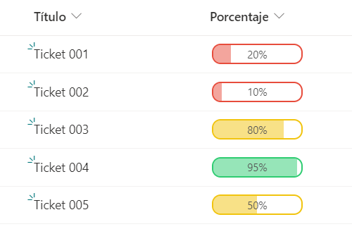

# Formato de Columna

## Formato Semaforo

Actualiza el valor de la columna cuando se hace clic en el valor requerido a actualizar.

## Datos de la columna

| Nombre Interno | Nombre Visual | Tipo               |
| -------------- | ------------- | ------------------ |
| Title          | Título        | Una línea de Texto |
| Porcentaje     | Porcentaje    | Número             |

## Valores de la columna "Estado"

| Valores   |
| --------- |
| >= 0      |
| <= 100    |